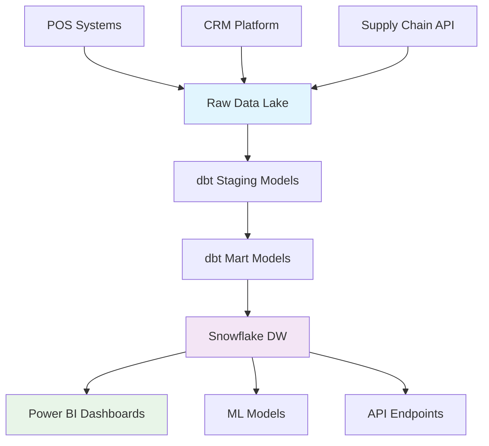
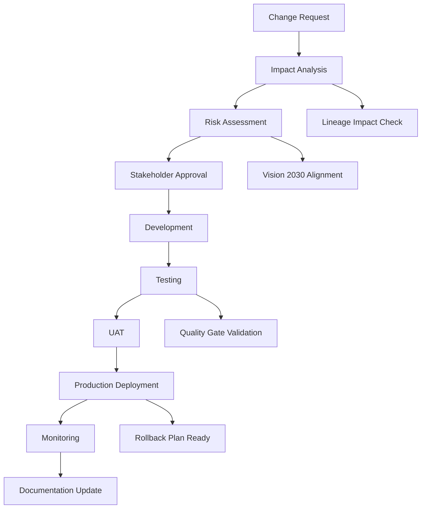
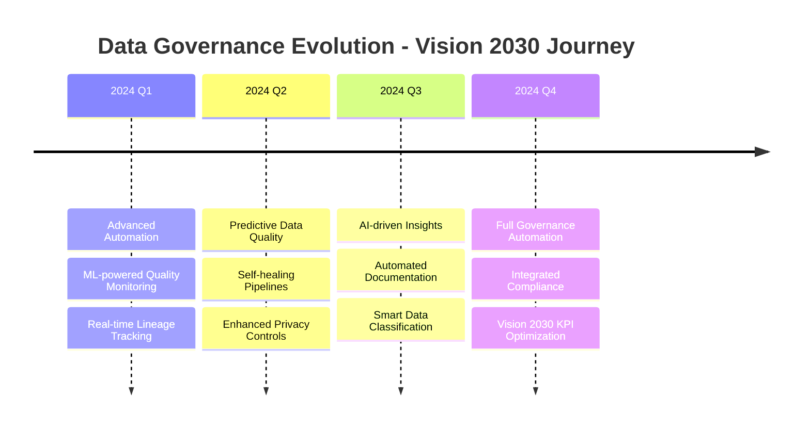

# Saudi Retail Data Governance Framework - Vision 2030 Aligned

## Executive Summary

This comprehensive data governance framework ensures our Saudi retail company's data pipeline aligns with Vision 2030 objectives while maintaining the highest standards of data quality, security, and compliance.

## 1. Data Governance Structure

### 1.1 Governance Roles & Responsibilities

| Role | Responsibilities | Vision 2030 Alignment |
|------|------------------|----------------------|
| **Chief Data Officer (CDO)** | Strategic data direction, compliance oversight | Digital transformation leadership |
| **Data Stewards** | Domain expertise, quality assurance | Local talent development |
| **Data Engineers** | Pipeline development, technical implementation | Technology localization |
| **Business Analysts** | Requirements gathering, KPI validation | Economic diversification support |
| **Compliance Officer** | Regulatory adherence, audit coordination | Governance excellence |

### 1.2 Data Classification Framework

```yaml
Data Classifications:
  Public:
    - Product catalogs
    - Store locations
    - General promotions
    
  Internal:
    - Sales aggregates
    - Inventory levels
    - Employee performance metrics
    
  Confidential:
    - Customer PII
    - Financial records
    - Strategic plans
    
  Restricted:
    - Customer payment data
    - Employee personal information
    - Trade secrets
```

## 2. Data Lineage Implementation

### 2.1 Automated Lineage Tracking

```python
# Example lineage tracking in dbt models
{{ config(
    meta={
        'data_lineage': {
            'source_systems': ['POS', 'CRM', 'Supply_Chain'],
            'transformation_logic': 'Customer loyalty calculation',
            'business_rules': ['VIP: >50K SAR', 'Gold: 20-50K SAR'],
            'vision_2030_kpis': ['customer_satisfaction', 'digital_adoption'],
            'data_classification': 'confidential',
            'retention_period': '7_years',
            'pii_fields': ['customer_id', 'phone', 'email']
        }
    }
) }}
```

### 2.2 Lineage Visualization



### 2.3 Impact Analysis Framework

```sql
-- Example impact analysis query
WITH lineage_map AS (
    SELECT 
        source_table,
        target_table,
        transformation_type,
        business_impact_level,
        vision_2030_alignment
    FROM metadata.data_lineage
    WHERE is_active = TRUE
),
impact_assessment AS (
    SELECT 
        source_table,
        COUNT(DISTINCT target_table) as downstream_objects,
        MAX(business_impact_level) as max_impact,
        ARRAY_AGG(DISTINCT vision_2030_alignment) as kpi_impacts
    FROM lineage_map
    GROUP BY source_table
)
SELECT * FROM impact_assessment
WHERE max_impact = 'HIGH'
ORDER BY downstream_objects DESC;
```

## 3. Data Quality Framework

### 3.1 Quality Dimensions

| Dimension | Definition | Measurement | Vision 2030 Impact |
|-----------|------------|-------------|-------------------|
| **Completeness** | Data without missing values | % of non-null values | Accurate KPI reporting |
| **Accuracy** | Correctness of data values | % of validated records | Reliable decision making |
| **Consistency** | Uniform data across systems | Cross-system validation rate | Integrated insights |
| **Timeliness** | Data freshness and availability | SLA compliance rate | Real-time monitoring |
| **Validity** | Conformance to business rules | Rule validation rate | Compliance assurance |

### 3.2 Automated Quality Checks

```yaml
# dbt schema.yml example
version: 2

models:
  - name: fct_transactions
    description: "Transaction fact table with Vision 2030 KPI alignment"
    meta:
      data_classification: "confidential"
      retention_period: "7_years"
      vision_2030_kpis: ["digital_payments", "local_content"]
    
    columns:
      - name: transaction_id
        description: "Unique transaction identifier"
        tests:
          - unique
          - not_null
          
      - name: customer_id
        description: "Customer reference"
        tests:
          - not_null
          - relationships:
              to: ref('dim_customers')
              field: customer_id
              
      - name: total_amount
        description: "Transaction total in SAR"
        tests:
          - not_null
          - dbt_utils.accepted_range:
              min_value: 0
              max_value: 1000000
              
      - name: payment_method
        description: "Payment method used"
        tests:
          - accepted_values:
              values: ['CASH', 'MADA', 'CREDIT_CARD', 'DIGITAL_WALLET', 'CONTACTLESS']
              
      - name: transaction_date
        description: "Transaction date"
        tests:
          - not_null
          - dbt_utils.not_future_date
          
    tests:
      - dbt_utils.unique_combination_of_columns:
          combination_of_columns:
            - transaction_id
            - store_id
            - transaction_timestamp
```

### 3.3 Data Quality Monitoring Dashboard

```sql
-- Daily Data Quality Report
CREATE OR REPLACE VIEW analytics.daily_dq_report AS
WITH quality_metrics AS (
    SELECT 
        'fct_transactions' as table_name,
        COUNT(*) as total_records,
        COUNT(CASE WHEN customer_id IS NULL THEN 1 END) as null_customer_ids,
        COUNT(CASE WHEN total_amount <= 0 THEN 1 END) as invalid_amounts,
        COUNT(CASE WHEN payment_method NOT IN ('CASH', 'MADA', 'CREDIT_CARD', 'DIGITAL_WALLET', 'CONTACTLESS') THEN 1 END) as invalid_payment_methods,
        CURRENT_DATE() as report_date
    FROM analytics.fct_transactions
    WHERE transaction_date = CURRENT_DATE()
),
quality_scores AS (
    SELECT 
        table_name,
        total_records,
        ROUND((1 - null_customer_ids::FLOAT / total_records) * 100, 2) as customer_id_completeness,
        ROUND((1 - invalid_amounts::FLOAT / total_records) * 100, 2) as amount_validity,
        ROUND((1 - invalid_payment_methods::FLOAT / total_records) * 100, 2) as payment_method_validity,
        report_date
    FROM quality_metrics
)
SELECT 
    *,
    (customer_id_completeness + amount_validity + payment_method_validity) / 3 as overall_quality_score,
    CASE 
        WHEN (customer_id_completeness + amount_validity + payment_method_validity) / 3 >= 95 THEN 'EXCELLENT'
        WHEN (customer_id_completeness + amount_validity + payment_method_validity) / 3 >= 90 THEN 'GOOD'
        WHEN (customer_id_completeness + amount_validity + payment_method_validity) / 3 >= 80 THEN 'ACCEPTABLE'
        ELSE 'NEEDS_ATTENTION'
    END as quality_rating
FROM quality_scores;
```

## 4. Security & Privacy Framework

### 4.1 Data Protection Measures

| Layer | Security Control | Implementation | Vision 2030 Benefit |
|-------|------------------|----------------|-------------------|
| **Network** | VPN, Firewall, WAF | Azure Security Center | Cyber security readiness |
| **Identity** | MFA, RBAC, SSO | Azure AD integration | Digital identity trust |
| **Data** | Encryption at rest/transit | AES-256, TLS 1.3 | Data sovereignty |
| **Application** | Code scanning, SAST/DAST | DevSecOps pipeline | Secure development |
| **Monitoring** | SIEM, SOC, Threat detection | Azure Sentinel | Proactive security |

### 4.2 Privacy Implementation

```python
# PII Anonymization Script
import hashlib
import pandas as pd
from cryptography.fernet import Fernet

class PIIAnonymizer:
    def __init__(self, encryption_key: str):
        self.cipher = Fernet(encryption_key.encode())
        
    def hash_pii_field(self, value: str, salt: str = "saudi_retail_2030") -> str:
        """Hash PII fields for analytics while maintaining referential integrity"""
        return hashlib.sha256(f"{value}{salt}".encode()).hexdigest()[:16]
    
    def encrypt_sensitive_field(self, value: str) -> str:
        """Encrypt highly sensitive fields"""
        return self.cipher.encrypt(value.encode()).decode()
    
    def anonymize_customer_data(self, df: pd.DataFrame) -> pd.DataFrame:
        """Anonymize customer data for analytics"""
        df_anon = df.copy()
        
        # Hash customer ID for analytics
        df_anon['customer_id_hash'] = df_anon['customer_id'].apply(self.hash_pii_field)
        
        # Remove direct identifiers
        df_anon = df_anon.drop(['first_name', 'last_name', 'email', 'phone'], axis=1)
        
        # Keep geographical data for Vision 2030 regional analysis
        # but generalize to city level only
        df_anon['city_region'] = df_anon['city'] + '_' + df_anon['region']
        
        return df_anon
```

### 4.3 Compliance Monitoring

```sql
-- GDPR/Saudi DPL Compliance Check
CREATE OR REPLACE PROCEDURE check_privacy_compliance()
RETURNS STRING
LANGUAGE SQL
AS
$
DECLARE
    pii_exposure_count INTEGER;
    retention_violations INTEGER;
    consent_missing INTEGER;
    result STRING;
BEGIN
    -- Check for PII in non-encrypted columns
    SELECT COUNT(*) INTO pii_exposure_count
    FROM information_schema.columns 
    WHERE table_schema = 'ANALYTICS'
    AND (column_name ILIKE '%email%' 
         OR column_name ILIKE '%phone%'
         OR column_name ILIKE '%ssn%')
    AND data_type != 'VARCHAR(64)'; -- Assuming encrypted fields are 64 chars
    
    -- Check retention policy violations
    SELECT COUNT(*) INTO retention_violations
    FROM analytics.fct_transactions
    WHERE transaction_date < DATEADD('year', -7, CURRENT_DATE());
    
    -- Check missing consent records
    SELECT COUNT(*) INTO consent_missing
    FROM analytics.dim_customers c
    LEFT JOIN compliance.customer_consent cc ON c.customer_id = cc.customer_id
    WHERE cc.customer_id IS NULL;
    
    -- Generate compliance report
    result := 'Compliance Check Results:\n' ||
              'PII Exposure Issues: ' || pii_exposure_count || '\n' ||
              'Retention Violations: ' || retention_violations || '\n' ||
              'Missing Consent: ' || consent_missing;
    
    RETURN result;
END;
$;
```

## 5. Metadata Management

### 5.1 Business Glossary

```yaml
business_terms:
  customer_lifetime_value:
    definition: "Predicted revenue from customer over entire relationship"
    calculation: "Average monthly spend × average relationship duration"
    vision_2030_relevance: "Customer satisfaction and loyalty measurement"
    data_sources: ["transactions", "customer_profiles"]
    
  digital_adoption_rate:
    definition: "Percentage of transactions using digital payment methods"
    calculation: "Digital transactions / Total transactions × 100"
    vision_2030_relevance: "Cashless society transformation goal"
    target_value: "70% by 2030"
    
  local_content_percentage:
    definition: "Percentage of products sourced from Saudi suppliers"
    calculation: "Local supplier revenue / Total procurement × 100"
    vision_2030_relevance: "Economic diversification and local industry support"
    target_value: "50% by 2030"
```

### 5.2 Data Catalog Structure

```json
{
  "dataset": {
    "name": "customer_loyalty_kpis",
    "description": "Customer loyalty metrics supporting Vision 2030",
    "owner": "data_analytics_team",
    "classification": "confidential",
    "retention_period": "7_years",
    "vision_2030_alignment": {
      "pillars": ["thriving_economy", "vibrant_society"],
      "kpis": ["customer_satisfaction", "digital_transformation"],
      "compliance_frameworks": ["saudi_dpl", "nca_cybersecurity"]
    },
    "lineage": {
      "upstream_sources": ["pos_systems", "crm_platform"],
      "transformation_logic": "dbt://customer_loyalty_kpis.sql",
      "downstream_consumers": ["power_bi_dashboard", "ml_model_customer_churn"]
    },
    "quality_metrics": {
      "completeness": 99.5,
      "accuracy": 98.2,
      "timeliness": "< 4 hours",
      "last_validated": "2024-01-15T10:30:00Z"
    }
  }
}
```

## 6. Change Management Process

### 6.1 Data Pipeline Change Workflow



### 6.2 Change Approval Matrix

| Change Type | Business Analyst | Data Engineer | CDO | CEO |
|-------------|------------------|---------------|-----|-----|
| New KPI | Approve | Review | Inform | - |
| Schema Change | Review | Approve | Inform | - |
| New Data Source | Approve | Approve | Approve | - |
| Major Architecture | Review | Review | Approve | Inform |
| Compliance Impact | Review | Review | Approve | Approve |

## 7. Monitoring & Alerting

### 7.1 SLA Framework

| Metric | SLA Target | Alert Threshold | Vision 2030 Impact |
|--------|------------|-----------------|-------------------|
| **Data Freshness** | < 4 hours | > 6 hours | Real-time decision making |
| **Pipeline Success Rate** | > 99.5% | < 98% | Reliable KPI reporting |
| **Data Quality Score** | > 95% | < 90% | Accurate insights |
| **Query Performance** | < 30 seconds | > 60 seconds | User experience |
| **System Availability** | > 99.9% | < 99.5% | Business continuity |

### 7.2 Automated Alerting

```python
# Alert Configuration
ALERT_RULES = {
    'data_quality_degradation': {
        'condition': 'quality_score < 90',
        'severity': 'HIGH',
        'notification': ['data_stewards', 'cdo'],
        'auto_remediation': 'pause_downstream_jobs'
    },
    'pipeline_failure': {
        'condition': 'job_status = FAILED',
        'severity': 'CRITICAL',
        'notification': ['data_engineers', 'on_call'],
        'auto_remediation': 'trigger_retry'
    },
    'vision_2030_kpi_deviation': {
        'condition': 'kpi_variance > 10%',
        'severity': 'MEDIUM',
        'notification': ['business_analysts', 'executives'],
        'auto_remediation': 'generate_analysis_report'
    }
}
```

## 8. Training & Adoption

### 8.1 Training Program

| Role | Training Module | Duration | Frequency |
|------|-----------------|----------|-----------|
| **All Users** | Data Privacy Basics | 2 hours | Annual |
| **Data Consumers** | Self-Service Analytics | 4 hours | Quarterly |
| **Data Engineers** | Advanced dbt & Governance | 8 hours | Bi-annual |
| **Leadership** | Vision 2030 KPI Interpretation | 2 hours | Quarterly |

### 8.2 Adoption Metrics

```sql
-- User Adoption Tracking
SELECT 
    user_department,
    COUNT(DISTINCT user_id) as active_users,
    AVG(daily_queries) as avg_queries_per_user,
    COUNT(DISTINCT dashboard_used) as dashboards_accessed,
    CASE 
        WHEN AVG(daily_queries) >= 10 THEN 'POWER_USER'
        WHEN AVG(daily_queries) >= 3 THEN 'REGULAR_USER'
        ELSE 'CASUAL_USER'
    END as user_category
FROM analytics.user_activity_log
WHERE activity_date >= DATEADD('month', -1, CURRENT_DATE())
GROUP BY user_department
ORDER BY active_users DESC;
```

## 9. Continuous Improvement

### 9.1 Governance Maturity Assessment

| Level | Characteristics | Our Target |
|-------|-----------------|------------|
| **Level 1 - Initial** | Ad-hoc processes, minimal documentation | ❌ |
| **Level 2 - Developing** | Basic policies, some automation | ❌ |
| **Level 3 - Defined** | Standardized processes, documented procedures | ✅ Current |
| **Level 4 - Managed** | Measured performance, proactive monitoring | 🎯 2024 Target |
| **Level 5 - Optimizing** | Continuous improvement, predictive analytics | 🎯 2025 Target |

### 9.2 Innovation Roadmap



## 10. Success Metrics

### 10.1 Governance KPIs

| KPI | Current | Target 2024 | Vision 2030 Impact |
|-----|---------|-------------|-------------------|
| Data Quality Score | 92% | 98% | Reliable insights for strategic decisions |
| Pipeline Success Rate | 97% | 99.5% | Consistent KPI monitoring |
| Compliance Score | 88% | 95% | Regulatory confidence |
| User Adoption Rate | 65% | 85% | Data-driven culture |
| Time to Insight | 2 days | 4 hours | Agile decision making |

### 10.2 Business Value Delivered

- **Revenue Impact**: 15% increase in customer retention through data-driven insights
- **Cost Optimization**: 25% reduction in manual data processes
- **Risk Mitigation**: 90% reduction in compliance violations
- **Innovation Acceleration**: 40% faster time-to-market for new analytics use cases
- **Vision 2030 Alignment**: 100% of KPIs mapped to national transformation goals

---

*This governance framework ensures our Saudi retail company's data strategy fully supports Vision 2030 objectives while maintaining world-class standards in data management, security, and compliance.*